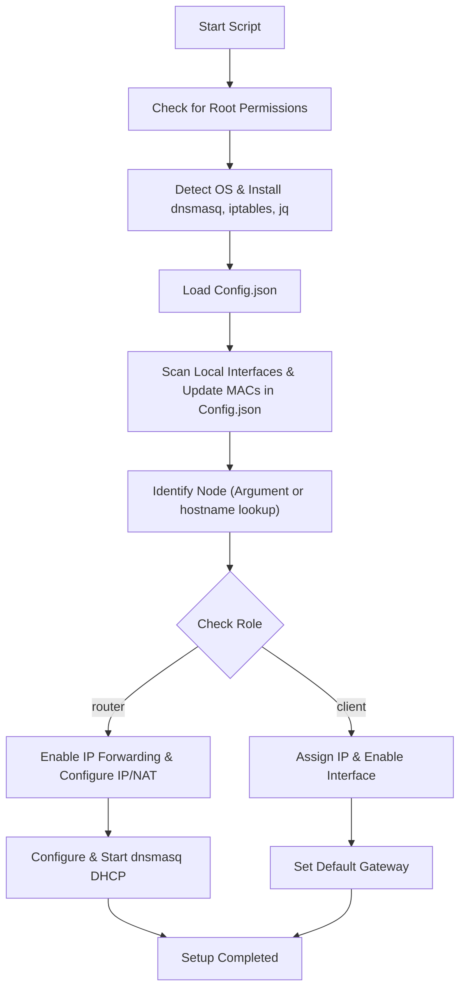

# Auto-config Router

Automated shell script for configuring Linux systems as routers or clients. It uses a structured JSON configuration file, supports automatic package installation across Debian, RHEL, and Arch platforms, and dynamically records MAC addresses back into the configuration file.

## Features

- **Distribution Awareness**: Automatically detects Debian/Ubuntu, RHEL/Rocky, and Arch-based systems to execute the correct package manager actions.
- **Automated Dependencies**: Installs `dnsmasq`, `iptables`, and the JSON processor `jq`.
- **Dynamic MAC Address Mapping**: Scans the network interfaces configured in `Config.json` that are present on the host, reads their physical MAC addresses, and dynamically writes them directly into the interface objects inside the JSON file.
- **Router Configuration Mode**:
  - Automatically enables IPv4 packet forwarding (`sysctl`).
  - Assigns IP addresses to the listed interfaces.
  - Automatically configures NAT (`iptables` masquerade) on the WAN interface.
  - Configures and restarts DHCP services (`dnsmasq`) for client ranges.
- **Client Configuration Mode**:
  - Enables interfaces and assigns IPs.
  - Configures default gateway routing via the router's IP address.
- **Windows File System Compatibility**: Cleans Windows-style carriage returns (`\r`) automatically from configuration parameters.

## Flowchart



## Usage

1. Populate the configuration templates in [Config_template.json](file:///c:/Users/Jmoessmer/Documents/_GITHUB_Repos/Linux-commands-and-scripts/Auto-config_router/Config_template.json) or create [Config.json](file:///c:/Users/Jmoessmer/Documents/_GITHUB_Repos/Linux-commands-and-scripts/Auto-config_router/Config.json).
2. Set execute permissions on the script:
   ```bash
   chmod +x autoconfigv2.sh
   ```
3. Run the script as root specifying the target node configuration block (defaults to hostname detection or `router`):
   ```bash
   sudo ./autoconfigv2.sh router
   ```
   Or for a client:
   ```bash
   sudo ./autoconfigv2.sh client1
   ```

## Configuration Schema

The script uses a nested JSON structure grouping interface details together:
```json
{
    "router": {
        "role": "router",
        "interfaces": [
            {
                "name": "ens224"
            },
            {
                "name": "ens256"
            }
        ],
        "ips": [
            "172.16.7.33/27",
            "172.16.7.97/27"
        ],
        "dhcp": [
            "172.16.7.34,172.16.7.63,12h",
            "172.16.7.98,172.16.7.127,12h"
        ]
    },
    "client1": {
        "role": "client",
        "interface": {
            "name": "ens224"
        },
        "ip": "172.16.7.42/27",
        "gateway": "172.16.7.33"
    }
}
```
After the script runs, it writes the physical MAC addresses into the configuration file:
- For routers: `.[node].interfaces[index].mac = "00:0c:29:xx:xx:xx"`
- For clients: `.[node].interface.mac = "00:0c:29:xx:xx:xx"`
