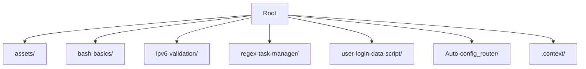

# Linux Commands and Scripts

This repository serves as a centralized collection for all of my small Linux projects, utility scripts, and commands. Each project is organized in its own subdirectory and contains its own detailed documentation.

## Table of Contents (TOC)
## Directory Layout

- [User Login Data Script](./user-login-data-script/README.md) - Bash script for automated user creation from a CSV file, supporting various Linux distributions.
- [Bash Basics](./bash-basics/README.md) - Introductory exercises showing basic greeting statements and parameter printing.
- [IPv6 Validation](./ipv6-validation/README.md) - Tool for validating IPv6 formats using regular expressions, supporting both command-line arguments and interactive prompts.
- [Regex Task Manager](./regex-task-manager/README.md) - A central terminal-based dashboard that guides users through 10 different Regex extraction and filtering tasks.
- [Auto-config Router](./Auto-config_router/README.md) - Distro-aware automation script for configuring systems as a Router or Client using a central JSON file and dynamic MAC address mapping.

---

## Project Catalog

### 1. [User Login Data Script](./user-login-data-script/README.md)
* **Path**: `user-login-data-script/`
* **Description**: Reads a CSV file containing first names, last names, and birth dates, and creates corresponding Linux system users.
* **Key Features**:
  - Automatically detects the active Linux distribution (e.g., Debian/Ubuntu, RHEL/Fedora, Alpine, Arch) and applies the correct user-creation commands.
  - Normalizes names to generate valid Unix usernames (converts to lowercase, cleans German umlauts like `ä` -> `ae`, and strips invalid characters).
  - Assigns standard passwords following the pattern `Firstname.Lastname.Birthdate`.
  - Automatically cleans Windows carriage returns (`\r\n`).

### 2. [Bash Basics](./bash-basics/README.md)
* **Path**: `bash-basics/`
* **Description**: Basic shell programming examples.
* **Key Features**:
  - Greeting output with self-name resolution (`$0`).
  - Positional argument printer supporting arguments 1 to 10 (`${10}`).

### 3. [IPv6 Validation](./ipv6-validation/README.md)
* **Path**: `ipv6-validation/`
* **Description**: Validates IPv6 addresses (standard/compressed/mapped).
* **Key Features**:
  - Runs in CLI-argument mode or interactive prompt mode.
  - Applies a comprehensive regular expression to check validity.

### 4. [Regex Task Manager](./regex-task-manager/README.md)
* **Path**: `regex-task-manager/`
* **Description**: Interactive terminal dashboard executing 10 regex filtration assignments.
* **Key Features**:
  - Colorful TUI dashboard with safe input loops.
  - Network logs parser (IPv4, IPv6, interfaces).
  - User database parser (UID/GID filtering).
  - Protocol database column extraction and counting (ports, protocol unique counts).

### 5. [Auto-config Router](./Auto-config_router/README.md)
* **Path**: `Auto-config_router/`
* **Description**: Distro-aware automation script for configuring systems as a Router or Client using a central JSON file.
* **Key Features**:
  - Distro-aware automated installation of required packages (`dnsmasq`, `iptables`, and JSON parser `jq`).
  - Automatically scans local network interfaces and dynamically maps/records their MAC addresses into the configuration JSON file (`Config.json`).
  - Sets up routing logic (enabling IPv4 forwarding and NAT iptables rules) or default gateway settings depending on host role.
  - Configures DHCP service ranges automatically using `dnsmasq`.