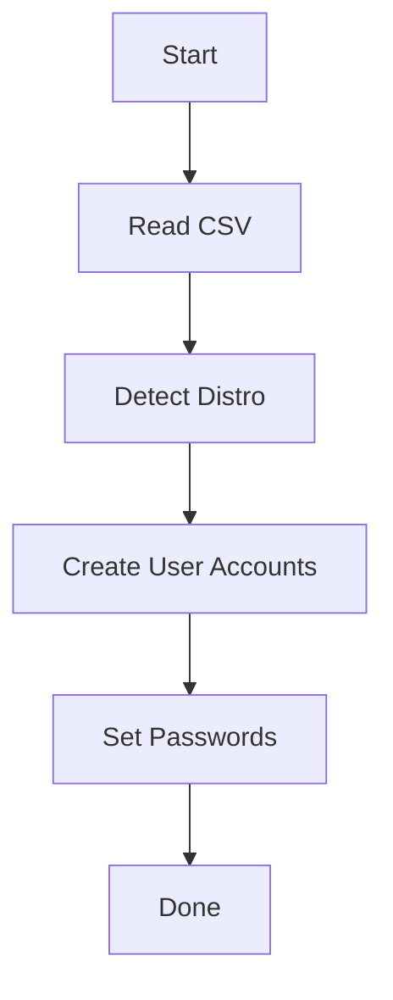

# User Login Data Script

This script automates the creation of Linux user accounts from a CSV file. It reads first names, last names, and birth dates, normalizes the username (including lowercasing and German umlaut cleanup), and assigns a default password matching the pattern `FirstName.LastName.BirthDate`.

## Features
- **Distribution Detection**: Automatically detects the active Linux distribution (Debian, Ubuntu, CentOS, RedHat, Fedora, Alpine, Arch) and adjusts shells and user creation commands accordingly.
- **Umlaut & Special Character Cleanup**: Automatically converts German umlauts (ä -> ae, ö -> oe, ü -> ue, ß -> ss) and other special characters to generate valid Unix usernames.
- **Windows CSV Support**: Automatically filters out carriage returns (`\r`), ensuring CSV files edited on Windows systems can be parsed without issues.
- **Delimiter Tolerance**: Supports both comma (`,`) and semicolon (`;`) as CSV separators.

## Flowchart



## Example Run

```bash
./create_users.sh users_sample.csv
```

Sample output:
```
Creating user: max.mustermann ...
User max.mustermann created.
Creating user: erika.musterfrau ...
User erika.musterfrau created.
```


## CSV Format
The CSV file should contain a header row. Example (`users_sample.csv`):
```csv
FirstName,LastName,BirthDate
Max,Mustermann,01.01.1990
Erika,Musterfrau,31.12.1985
Maria,Groß,07.07.1992
Hans,Müller,24.12.1995
```

For instance, `Maria Groß` results in:
- **Username:** `maria.gross`
- **Password:** `Maria.Groß.07.07.1992`

## Usage
The script requires root privileges to create user accounts.

1. **Make the script executable**:
   ```bash
   chmod +x create_users.sh
   ```

2. **Run the script**:
   ```bash
   sudo ./create_users.sh users_sample.csv
   ```

## Technical Details
- **Username Normalization**: Generates `firstname.lastname` in lowercase. Spaces are replaced with dashes (`-`). Any invalid characters are stripped.
- **Password Assignment**: Uses `chpasswd` by default for secure, non-interactive password assignment. Fallbacks for `passwd --stdin` and interactive pipe emulation are built-in.
